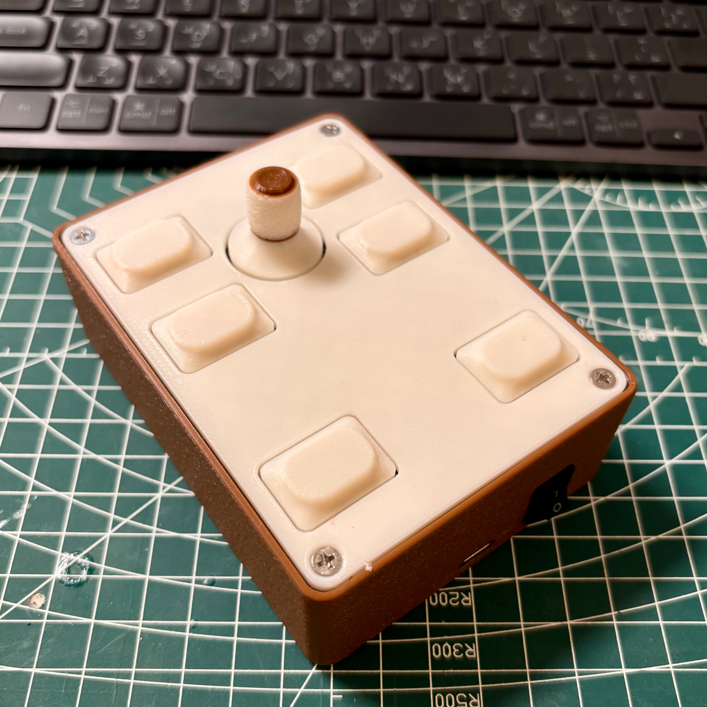

# Living Room Remote



A simple ESP32-based remote control system for home automation, featuring physical buttons, a dimmer potentiometer, and MQTT integration for Home Assistant.

## Features

- 6 programmable buttons in a 3x2 matrix layout
- Analog dimmer control with high-precision potentiometer (ADS1015)
- Battery level monitoring and reporting
- Status LED indicator with different colors for different actions
- MQTT integration for Home Assistant
- Deep sleep power management for extended battery life

## Hardware Requirements

- ESP32 board (tested with DFrobot Beetle ESP32-C6 V1.0)
- 6x momentary push buttons arranged in a 3x2 matrix
- ADS1015 analog-to-digital converter for potentiometer reading
- WS2812 NeoPixel LED for status indication
- Battery (Li-ion, 3.7V)

## Pin Configuration

### Button Matrix
- Rows (RTC GPIOs): GPIO 5, 7, 6
- Columns: GPIO 22, 23

### Sensors & Indicators
- ADS1015 Alert Pin: GPIO 4 (RTC GPIO)
- Battery ADC: GPIO 0
- NeoPixel LED: GPIO 21

## Deep Sleep Functionality

The device uses ESP32's deep sleep mode to conserve battery:
- Wakes up when any button is pressed
- Wakes up when potentiometer value changes (via ADS1015 alert)
- Wakes up periodically to check battery level (every 60 seconds)
- Auto-sleeps after 1 minute of inactivity

## Required Libraries
- PubSubClient
- Adafruit_NeoPixel
- ADS1015_WE
- WiFi (built-in)

## Installation

1. Clone this repository
```bash
git clone https://github.com/yourusername/livingroom-remote.git
```

2. Copy the credentials template
```bash
cp credentials_example.h credentials.h
```

3. Edit `credentials.h` with your settings:
```cpp
#define WIFI_SSID "Your_WiFi_SSID"
#define WIFI_PASSWORD "Your_WiFi_Password"

#define MQTT_SERVER "Your_MQTT_Server_IP"
#define MQTT_PORT 1883
#define MQTT_USER "Your_MQTT_Username"
#define MQTT_PASSWORD "Your_MQTT_Password"
```

## MQTT Topics

The device publishes to the following MQTT topics:

- `livingRoomRemote/buttons/1` to `livingRoomRemote/buttons/6` - Button press events (payload: "PRESSED")
- `livingRoomRemote/potentiometer` - Dimmer value (0.00-100.00%)
- `livingRoomRemote/battery/percentage` - Battery level percentage (0.00-100.00%)

## Home Assistant Integration

Add the following to your Home Assistant configuration:

```yaml
mqtt:
  sensor:
    - name: "Living Room Remote Battery Level"
      state_topic: "livingRoomRemote/battery/percentage"
      unit_of_measurement: "%"
      device_class: "battery"
      
    - name: "Living Room Remote Dimmer"
      state_topic: "livingRoomRemote/potentiometer"
      unit_of_measurement: "%"

  binary_sensor:
    - name: "Memory Button 1"
      state_topic: "livingRoomRemote/buttons/1"
      payload_on: "PRESSED"
      off_delay: 1
    # ... repeat for other buttons ...
```

## Status LED Indicators

- **Blue**: Button press detected
- **Purple**: Potentiometer (dimmer) value changed
- **Green**: Battery status reported (normal)
- **Red**: Battery status reported (low)

## Battery Monitoring

- Voltage range: 3.0V (empty) to 4.2V (full)
- Status checked every 10 minutes
- Voltage calibration factor adjustable in `defines.h`

## Customization

Most settings can be customized in `defines.h`:
- Sleep timer duration
- LED brightness and colors
- Battery check interval
- MQTT topics
- Pin assignments

## Resources
 - These are some links to resources that could be helpful when implementing this project.
    - https://www.home-assistant.io/integrations/manual_mqtt/
    - https://community.home-assistant.io/t/using-a-sensor-value-to-control-the-brightness-of-a-light-in-ha/413504
    - https://community.home-assistant.io/t/creating-packages/209654/6
    - https://github.com/home-assistant/addons/blob/174f8e66d0eaa26f01f528beacbde0bd111b711c/mosquitto/DOCS.md#how-to-use
